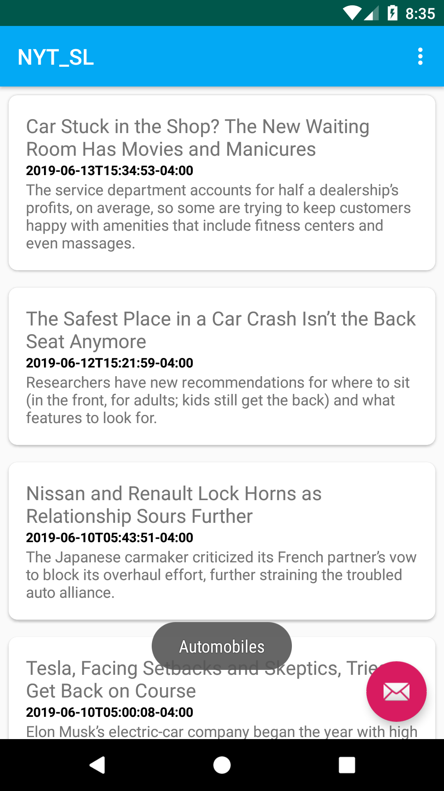

# NY-Times-API-EXAMPLE-Android-App
NY Times API Is Used to Make News Related Android App Which Could Show Variety Of News in Different Sections 

App uses NY Times API to Fetch News using JSON.
It uses Volley Library to Parse JSON Objects..

<h3>Screenshots:-<h3>

